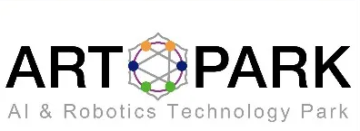

<div id="top"></div>
<!--

-->


<!-- PROJECT SHIELDS -->
<!--
*** I'm using markdown "reference style" links for readability.
*** Reference links are enclosed in brackets [ ] instead of parentheses ( ).
*** See the bottom of this document for the declaration of the reference variables
*** for contributors-url, forks-url, etc. This is an optional, concise syntax you may use.
*** https://www.markdownguide.org/basic-syntax/#reference-style-links
-->

<!-- PROJECT LOGO -->
<br />
<div align="center">
  <a href="https://www.artpark.in/">
    
  </a>

  <h2 align="center">Innovation Grant Program</h2>

  <p align="center">
    The program invites highly motivated and talented faculty members, along with their under-graduate and post-graduate students, to apply for research projects in the areas of Artificial Intelligence, Robotics and Autonomous Systems
    <br />
    <a href="https://www.artpark.in/innoProgramme"><strong>Know More About the Program »</strong></a>
    <br />
    <h3 align="center">Project Title: Traffic Voilaton Detection using CCTV cameras</h3>
    <br />
    <h3 align="center">DONE BY</h3>
    <h4> &nbsp;&nbsp;&nbsp;&nbsp;&nbsp;&nbsp;&nbsp; CHETHAN S &nbsp;&nbsp;&nbsp;&nbsp;&nbsp;&nbsp;&nbsp;&nbsp;&nbsp;&nbsp;&nbsp;&nbsp;&nbsp;&nbsp;&nbsp;&nbsp;&nbsp;&nbsp;&nbsp;&nbsp;&nbsp;&nbsp;&nbsp;&nbsp;&nbsp;&nbsp; PRAJWAL K &nbsp;&nbsp;&nbsp;&nbsp;&nbsp;&nbsp;&nbsp;&nbsp;&nbsp;&nbsp;&nbsp;&nbsp;&nbsp;&nbsp;&nbsp;&nbsp;&nbsp;&nbsp;&nbsp;&nbsp;&nbsp;&nbsp;NEHAL CHAKRAVARTY &nbsp;&nbsp;&nbsp;&nbsp;&nbsp;&nbsp;&nbsp;&nbsp;&nbsp;&nbsp;&nbsp;SHIVARAJ B KAREGERA <h4>
    <h5>RV College of Engineering &nbsp;&nbsp;&nbsp;&nbsp;&nbsp;&nbsp;&nbsp;&nbsp;&nbsp;&nbsp;RV College of Engineering &nbsp;&nbsp;&nbsp;&nbsp;&nbsp;&nbsp;&nbsp;&nbsp;&nbsp;&nbsp;&nbsp; RV College of Engineering &nbsp;&nbsp;&nbsp;&nbsp;&nbsp;&nbsp;&nbsp;&nbsp;&nbsp;&nbsp;&nbsp;&nbsp; RV College of Engineering <h5>
    <br />
    <h3 align="center">Under the Guidence Of</h3>
    <h4> Dr. Ramakanth Kumar <h4>
    <h5> Head Of the Department, Dept. of CSE, RVCE <h5>
  <!--
    <a href="PROFILE URL">CHETHAN S</a>
    ·
    <a href="PROFILE URL">PRAJWAL K</a>
    ·
    <a href="PROFILE URL">NEHAL CHAKRAVARTY</a>
    .
    <a href="PROFILE URL">SHIVARAJ BK</a>
   -->
  </p>
</div>


<!-- TABLE OF CONTENTS -->
<details>
  <summary>Table of Contents</summary>
  <ol>
    <li>
      <a href="#about-the-project">About The Project</a>
      <ul>
        <li><a href="#built-with">Built With</a></li>
      </ul>
      <ul>
        <li><a href="#hardware-requirements">Hardware Requirements</a></li>
      </ul>
    </li>
    <li>
      <a href="#getting-started">Getting Started</a>
      <ul>
        <li><a href="#Jetson-Nano-Setup">Jetson Nano Setup</a></li>
        <li><a href="#prerequisites">Prerequisites</a></li>
        <li><a href="#installation">Installation</a></li>
      </ul>
    </li>
    <li><a href="#usage">Usage</a></li>
    <li><a href="#roadmap">Roadmap</a></li>
    <li><a href="#contributing">Contributing</a></li>
    <li><a href="#license">License</a></li>
    <li><a href="#contact">Contact</a></li>
    <li><a href="#acknowledgments">Acknowledgments</a></li>
  </ol>
</details>


<!-- ABOUT THE PROJECT -->
## About The Project


To ensure safety measures on roads of India, the identification of traffic rule violators is highly desirable but challenging job due to numerous difficulties such as occlusion, illumination, etc. In this project we propose an end-to-end framework for detection of violations and notifying violators. The creation of automatic detection systems for traffic rules violations on signal jumping, speed limit cross, riding two-wheeler without helmet is necessary to improve and manage road safety in the country.

To perform such autonomous system, we propose machine learning models which are trained by custom datasets obtained over the internet, wherein the images are caught by CCTV cameras. Every machine learning model that is proposed is trained to detect a particular violation. To train the models google colab platform was utilized for training and evaluation purposes.

The results obtained from the system proposed is that it’s able to detect the vehicles successfully and if any violations such as not wearing helmet, red light signal jumping, and one way violation is being detected by different models successfully. Lot of scope is present in the field of traffic monitoring and deep learning integration. Models can be trained with more data to increase confidentiality score and accuracy score. Developing an autonomous system which could detect violation and notify the commuters and the traffic policing department in real time is the direction for future work. 

To make the project standalone, we have used NVIDIA jetson nano. We have deployed the software into the jetson nano and connected it with IP camera. Hence, we have developed a complete product.

<p align="right">(<a href="#top">back to top</a>)</p>


### Built With

This section should list any major frameworks/libraries used to bootstrap your project. Leave any add-ons/plugins for the acknowledgements section. Here are a few examples.

* [Python](https://www.python.org/)
* [OpenCV](https://opencv.org/)
* [MobileNet](https://github.com/chuanqi305/MobileNet-SSD/)
* [Haar-Cascade](https://github.com/CHETHAN-CS/vehicle_detection_using_haarcascade/)

<p align="right">(<a href="#top">back to top</a>)</p>

### Hardware Requirements

The hardware requirements in this project are as follows

* [IP Camera](https://en.wikipedia.org/wiki/IP_camera/)
* [NVIDIA Jetson Nano](https://developer.nvidia.com/embedded/jetson-nano-developer-kit/)
* [Display Monitor](https://en.wikipedia.org/wiki/Computer_monitor/)
* [Keyboard](https://en.wikipedia.org/wiki/Computer_keyboard)
* [Mouse](https://en.wikipedia.org/wiki/Computer_mouse/)
* [Power Adapter](https://forums.developer.nvidia.com/t/power-supply-considerations-for-jetson-nano-developer-kit/71637/)

<p align="right">(<a href="#top">back to top</a>)</p>

<!-- GETTING STARTED -->
## Getting Started

Follow the guidelines/steps given Below to Install and RUN the project on NVIDIA Jetson Nano.

### Jetson-Nano-Setup
In order to RUN the project in Jetson nano you need to do initial Setup for Jetson nano. Follow the instructions given in the NVIDIA Jeson nano Installation manual.
Follow this Link to access the manual and proceed with the setup.
      https://developer.nvidia.com/embedded/learn/get-started-jetson-nano-devkit


### Prerequisites

This is an example of how to list things you need to use the software and how to install them.
* npm
  ```sh
  npm install npm@latest -g
  ```

### Installation

_Below is an example of how you can instruct your audience on installing and setting up your app. This template doesn't rely on any external dependencies or services._

1. Get a free API Key at [https://example.com](https://example.com)
2. Clone the repo
   ```sh
   git clone https://github.com/your_username_/Project-Name.git
   ```
3. Install NPM packages
   ```sh
   npm install
   ```
4. Enter your API in `config.js`
   ```js
   const API_KEY = 'ENTER YOUR API';
   ```

<p align="right">(<a href="#top">back to top</a>)</p>


<!-- USAGE EXAMPLES -->
## Usage

Use this space to show useful examples of how a project can be used. Additional screenshots, code examples and demos work well in this space. You may also link to more resources.

_For more examples, please refer to the [Documentation](https://example.com)_

<p align="right">(<a href="#top">back to top</a>)</p>


<!-- ROADMAP -->
## Roadmap

- [x] Add Changelog
- [x] Add back to top links
- [ ] Add Additional Templates w/ Examples
- [ ] Add "components" document to easily copy & paste sections of the readme
- [ ] Multi-language Support
    - [ ] Chinese
    - [ ] Spanish

See the [open issues](https://github.com/othneildrew/Best-README-Template/issues) for a full list of proposed features (and known issues).

<p align="right">(<a href="#top">back to top</a>)</p>


<!-- CONTRIBUTING -->
## Contributing

Contributions are what make the open source community such an amazing place to learn, inspire, and create. Any contributions you make are **greatly appreciated**.

If you have a suggestion that would make this better, please fork the repo and create a pull request. You can also simply open an issue with the tag "enhancement".
Don't forget to give the project a star! Thanks again!

1. Fork the Project
2. Create your Feature Branch (`git checkout -b feature/AmazingFeature`)
3. Commit your Changes (`git commit -m 'Add some AmazingFeature'`)
4. Push to the Branch (`git push origin feature/AmazingFeature`)
5. Open a Pull Request

<p align="right">(<a href="#top">back to top</a>)</p>


<!-- LICENSE -->
## License

Distributed under the MIT License. See `LICENSE.txt` for more information.

<p align="right">(<a href="#top">back to top</a>)</p>


<!-- CONTACT -->
## Contact

Your Name - [@your_twitter](https://twitter.com/your_username) - email@example.com

Project Link: [https://github.com/your_username/repo_name](https://github.com/your_username/repo_name)

<p align="right">(<a href="#top">back to top</a>)</p>


<!-- ACKNOWLEDGMENTS -->
## Acknowledgments

Use this space to list resources you find helpful and would like to give credit to. I've included a few of my favorites to kick things off!

* [Choose an Open Source License](https://choosealicense.com)
* [GitHub Emoji Cheat Sheet](https://www.webpagefx.com/tools/emoji-cheat-sheet)
* [Malven's Flexbox Cheatsheet](https://flexbox.malven.co/)
* [Malven's Grid Cheatsheet](https://grid.malven.co/)
* [Img Shields](https://shields.io)
* [GitHub Pages](https://pages.github.com)
* [Font Awesome](https://fontawesome.com)
* [React Icons](https://react-icons.github.io/react-icons/search)

<p align="right">(<a href="#top">back to top</a>)</p>


<!-- MARKDOWN LINKS & IMAGES -->
<!-- https://www.markdownguide.org/basic-syntax/#reference-style-links -->
[contributors-shield]: https://img.shields.io/github/contributors/othneildrew/Best-README-Template.svg?style=for-the-badge
[contributors-url]: https://github.com/othneildrew/Best-README-Template/graphs/contributors
[forks-shield]: https://img.shields.io/github/forks/othneildrew/Best-README-Template.svg?style=for-the-badge
[forks-url]: https://github.com/othneildrew/Best-README-Template/network/members
[stars-shield]: https://img.shields.io/github/stars/othneildrew/Best-README-Template.svg?style=for-the-badge
[stars-url]: https://github.com/othneildrew/Best-README-Template/stargazers
[issues-shield]: https://img.shields.io/github/issues/othneildrew/Best-README-Template.svg?style=for-the-badge
[issues-url]: https://github.com/othneildrew/Best-README-Template/issues
[license-shield]: https://img.shields.io/github/license/othneildrew/Best-README-Template.svg?style=for-the-badge
[license-url]: https://github.com/othneildrew/Best-README-Template/blob/master/LICENSE.txt
[linkedin-shield]: https://img.shields.io/badge/-LinkedIn-black.svg?style=for-the-badge&logo=linkedin&colorB=555
[linkedin-url]: https://linkedin.com/in/othneildrew
[product-screenshot]: images/screenshot.png
